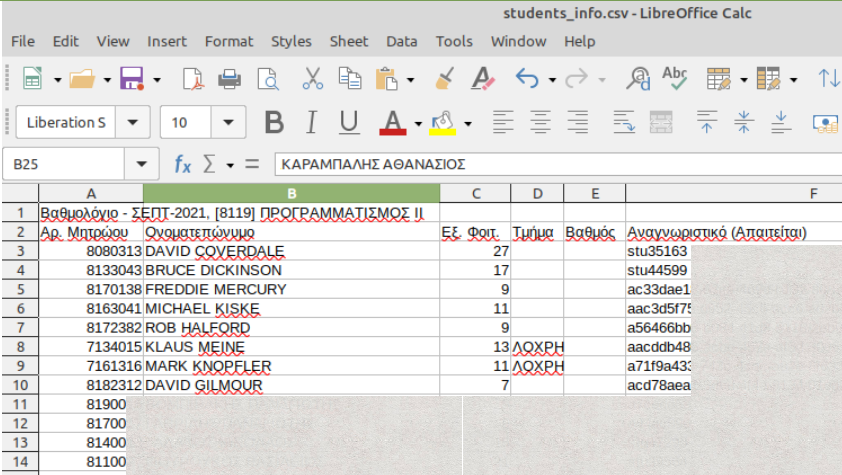
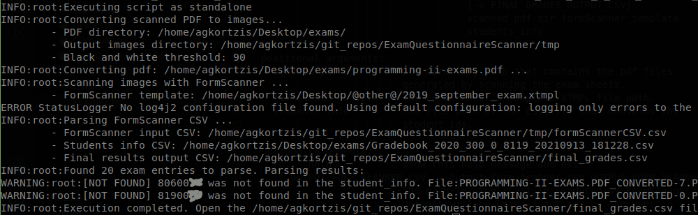
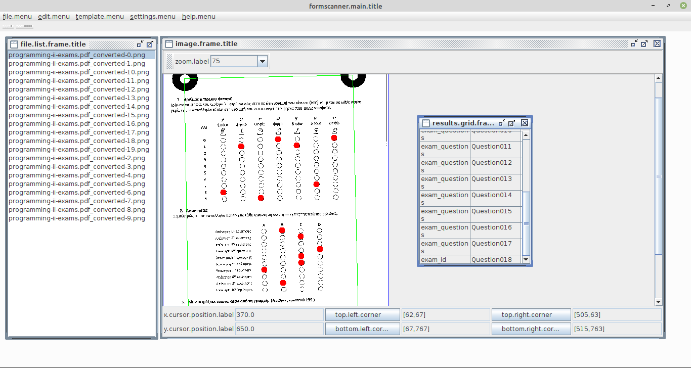

# Exam Questionnaire Scanner
[](https://travis-ci.org/AntonisGkortzis/ExamQuestionnaireScanner)
[](https://www.gnu.org/licenses/gpl-3.0)


## Dependencies
The following packages are required for converting the scanned PDF files to images, and for parsing the FormScanner CSV output file.

- [FormScanner](http://www.formscanner.org/) is a free and open source optical mark recognition (OMR) software for scanning and grading user-filled, multiple choice forms. The binary files of FormScanner are included in the ```lib``` directory of this repository, and thus, it is not required to be manually installed. Our tool uses a modified Formscanner version 1.1.2 in which we fix a missing Maven dependency and modify the output filename. The source code for the modified version is available on [Sourceforge](https://sourceforge.net/u/agkortzis/formscanner/ci/1.1/tree/).
- [ImageMagick](https://www.imagemagick.org/script/index.php) is a free open source application that can create, edit, compose, or convert bitmap images. For Debian/Ubuntu distributions install with ```sudo apt install imagemagick``` command.
- [Python 3](https://www.python.org/) (or later)
- [Java 6](https://www.oracle.com/technetwork/java/javase/downloads/index.html) (or later)


### Configure ImageMagick
In case you get permission errors during the image conversions you should provide the following permissions.
- In the file ```/etc/ImageMagick-6/policy.xml``` or ```/etc/ImageMagick/policy.xml``` change the line <br />
```<policy domain="coder" rights="none" pattern="PDF" />``` to <br />
```<policy domain="coder" rights="read|write" pattern="PDF" />```.
- In the same file, you may also need to modify the lines <br />
```<policy domain="resource" name="memory" value="256MiB"/>``` and <br />
```<policy domain="resource" name="disk" value="1GiB"/>``` <br />
and increase the values as much as possible. For a bundle of 100&ndash;150 exams 3&ndash;4GiBs of RAM are required.


## How to
This is a step-by-step guide for using this tool. The five main steps are listed below and described in detail in the following sections, along with further instructions.

 - [Step 1](#scan-the-exam-sheets): Scan the exam sheets.
 - [Step 2](#generate-a-formscanner-template): Generate a FormScanner template for the current exam layout (only if needed).
 - [Step 3](#prepare-the-students_info-input-file): Prepare the file containing the examination participants information.
 - [Step 4](#run-the-tool): Run the tool.
 - [Step 5](#manually-resolve-errors): Check the results and manually resolve any errors (if needed).


### 1. Scan the exam sheets
The first step of the grading process is the exam papers' scanning. Please note the following.

- Scanning the Programming II exams is performed on any professional printing/scanning device in the Printing Office at the ground floor of the AUEB main building. We prefer these devices for their capability to scan large batches of documents very fast with the use of the multiple-document feed tray (less than a minute for 150 exams). The scanning process is performed by the personnel of the Printing Office. Please contact [Areti Tsialiou](https://www.aueb.gr/el/faculty_page/tsialioy-areti) ot [Kostas Armyras](https://www.aueb.gr/el/faculty_page/%CE%B1%CF%81%CE%BC%CF%8D%CF%81%CE%B1%CF%82-%CE%BA%CF%8E%CF%83%CF%84%CE%B1%CF%82) before visiting the office and mention that you need to scan a batch of exams for the needs of Programming II course.
Alternatively you can scan the exams in any personal scanner but it requires manual labor and significantly more time.
- You should use only the back side of the exam sheet that contains the responses. To extract the even pages use a command like:  `pdftk both.pdf cat even output even_pages.pdf`.
- The device's scanning resolution should be set to 300dpi, color or gray-scale.
- The files generated from the scan process can be PDF files.
- The exams can be scanned in a single document (preferred option) or many smaller documents.

Retrieve the scanned files (with a USB or via email) and place them in a directory (in the device where the exam parsing will be performed) which will be used as the first argument in the **Run the tool** part of the process.


### 2. Generate a FormScanner template
A FormScanner template defines the scanning area of a questionnaire form, the number, the position  and the types of the questions.
When a new examination form is created the corresponding FormScanner template should be generated as well.
A new template may also be required when scanning with a different scanner
or settings.
This is seen when too many forms are incorrectly scanned.
FormScanner can be run from the `bin` directory with the command
`java -jar lib/formscanner-main-1.1.2.jar`.
On YouTube you can find a [video tutorial](https://www.youtube.com/watch?v=I1H8Wj6Tfp4) on how to generate examination forms and their corresponding templates.

**Important**: For the needs of Programming II examination, we use the ```programming-II-formscanner-template-*.xtmpl``` files, located at the ```data``` directory of the repository.


### 3. Prepare the students_info input file
This file contains the information of the current examination participants. It is required to cross-check the ID number in order to verify that:

- all participants are enrolled in the course, and
- there are no mistakes by participants when completing their ID number. These can lead to duplicate entries or matching failures.

The file should have a CSV format (strictly using **comma** as field separator) and contain the following fields: ```AM,Student Name```.
Any headers and/or trailing fields are omitted. An example of such a CSV file is presented in the following figure.




### 4. Run the tool
To run the tool go into the ```bin``` directory and execute the `cleaner.py` and the `examQuestionnaireScanner.py` scripts. A detailed usage help is presented below.
```
usage: python examQuestionnaireScanner.py [-h] [-f OUTPUT_FORM_SCANNER_CSV] [-s]
                                          [-j FORM_SCANNER_PATH]
                                          [-o FINAL_GRADES_OUTPUT_CSV]
                                          scanned_pdf_dir formScanner_template
                                          students_info

positional arguments:
  scanned_pdf_dir       The directory path that contains the PDF files
                        generated by scanning the exam sheets.
  formScanner_template  The FormScanner's template XTMPL file path.
  students_info         The file path of the CSV file that contains the
                        student IDs.

optional arguments:
  -h, --help            show this help message and exit
  -f OUTPUT_FORM_SCANNER_CSV, --output_form_scanner_csv OUTPUT_FORM_SCANNER_CSV
                        The path for the CSV file produced by FormScanner. The
                        default will be used if not set by the user.
  -s, --skip_pdf_conversion
                        A flag for skipping the PDF-to-images conversion
  -j FORM_SCANNER_PATH, --form_scanner_path FORM_SCANNER_PATH
                        The file path of the formscanner-main-XXX.jar
                        executable. The default will be used if not set by the
                        user.
  -o FINAL_GRADES_OUTPUT_CSV, --final_grades_output_csv FINAL_GRADES_OUTPUT_CSV
                        The parsed CSV file. The default will be used if not
                        set by the user.
```
#### Example
```
python cleaner.py
python examQuestionnaireScanner.py ../pdf ../data/programming-II-formscanner-template-2024-09.xtmpl '../ΒΑΘΜΟΛΟΓΙΟ ΠΡΟΓΡΑΜΜΑΤΙΣΜΟΣ ΙΙ (8119) 2023-2024 Εξετ. Σεπτ.csv'
```

### 5. Manually resolve errors
The successful completion of the parsing process (```examQuestionnaireScanner.py```) outputs results similar to the following screenshot.



At the end of the logged information two warnings ```[NOT FOUND]``` are displayed. These concern participant IDs that do not exist in the *students_info* file. Such cases are resolved manually by checking the physical exam and completing the missing information in the output CSV (named ```final_grades.csv``` by default) that contains the following information.


Entries 14 and 15 represent the aforementioned warnings. We manually check the exams (using the Exam ID field as a reference) and fill in the missing ID and student name fields. In case a student is not enrolled in the course, we document it in the comments field.

The log mentions the corresponding *image filename* to manually inspect and resolve the error. Parse failures (due to *parity check error* or *invalid student id*) are logged in the file ```bin/logs/error_logs```, and are also presented at the console at the end of the execution.


## Perform a manual inspection
If the output contains several warnings (indicating that one of the input files or/and parameters are faulty), or you just want to ensure that everything went fine with the process, you can do a manual optical inspection of the results. The process is described in the following steps.

1. In the ```bin``` directory open the FormScanner application with ```java -jar ./lib/formscanner-main-1.1.2.jar```.
2. Load the template that corresponds to the current exam: ```template --> load.template```.
3. Load the images generated from the scanned PDF: ```file --> open.images```.
4. Select an image from the left list and press ```ctrl+I```. The 5-step process is successful when  the red dots match the circles filled by the participant.




## Clean up the temporary files
Before or after the execution of the script (```examQuestionnaireScanner.py```) you may need to clean up the directories from files generated by previous runs of the tool. To do this go into the ```bin``` directory and run ```python cleaner.py```.

This script will automatically delete all files that are stored in the ```bin/tmp/``` directory.


## Limitations and Troubleshooting
- If there are many missed responses in the scanned exams you may need to re-adjust the density and the threshold of the FormScanner template. You can do this directly in the XTMPL file.
- White spaces in the input filenames (PDFs, FormScanner template, etc.) should be avoided because they cause unexpected behavior of the tool.

## See also
- [AMC](https://www.auto-multiple-choice.net/index.en)

## License
[](https://www.gnu.org/licenses/gpl-3.0)

This tool uses the FormScanner executables which are licensed under a GPL v3 license.
