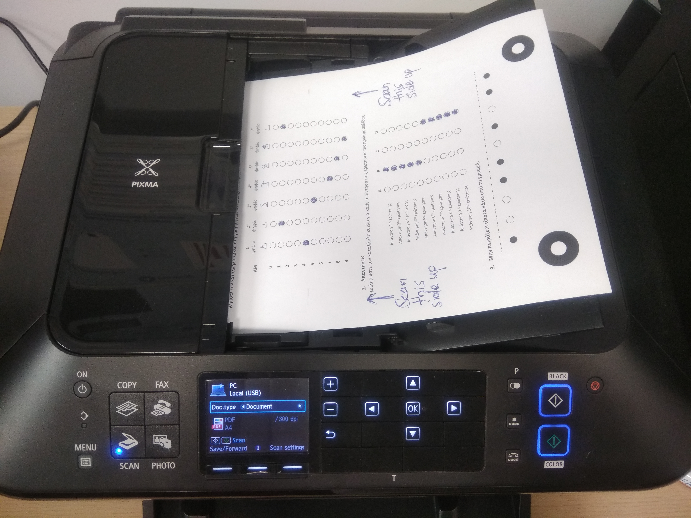

# Exam Questionnaire Scanner

[](https://coveralls.io/github/AntonisGkortzis/ExamQuestionnaireScanner?branch=master)
[](https://www.gnu.org/licenses/gpl-3.0)

## Dependencies
The following packages are required for converting the scanned pdf files to images and for parsing the FormScanner output csv file: 
- [FormScanner](http://www.formscanner.org/) is a free and open source OMR (optical mark recognition) software for scanning and grading user-filled, multiple choice forms.
- [ImageMagick](https://www.imagemagick.org/script/index.php) is a free open source application that can create, edit, compose, or convert bitmap images.
- [Python 3](https://www.python.org/) (or later)

## How to
This is a quick guide for the necessary steps for autograding the exams. 
### Scan the exam sheets
- The first and only manual step of the grading process is the scanning of the exam papers. The goal is to feed the FormScanner with an image file of each exam sheet. 
Unfortunately, our equipment does not offer the functionality of saving scanned documents to image format and thus, we are forced to create a **pdf** file for each scanned set of exam sheets. 
To automatically scan a bundle of exam, place the exam sheets on the top tray of the scanner, as it is illustrated in the following picture. 

- Retrieve the PDF files (one for each scanned bundle of exam sheets).

The parameters that are necessary for the execution of the tool are the following: 
- ```scanned_pdf_directory``` : The directory that contains the scanned exam sheets in **pdf** format. This directory should preferably store only the scanned pdf files.
- ```formScanner_template_xml``` : The path for the FormScannerTemplate xml file for the current exam sheet. If a template does not exist (or is not customized for the current exam sheet needs, create one by following the instructions [here](http://www.formscanner.org/quickstart-guide/quickstart-formscanner))
- ```students_info``` : A csv file that contains the student ids and their names. The current format of this file is the following (the values are not real):
```
Α/Α,Αρ. Μητρώου,Φοιτητής,Πατρώνυμο,Πρόγρ. Τμήματος
1,0000001,AN GOR [0000001],,DMST
2,0000002,STEF GRG [0000002],,DMST
```
- There are additional flags(```-f, -j, -s, -o```) for skipping steps or customizing the output files. If these are not set by the user then the produced files will be generated in the tool's working directory.

A detailed usage help is presented below:
```
python examQuestionnaireScanner.py --help

usage: examQuestionnaireScanner.py [-h] [-f OUTPUT_FORM_SCANNER_CSV] [-s]
                                   [-j FORM_SCANNER_PATH]
                                   [-o FINAL_GRADES_OUTPUT_CSV_FILE_PATH]
                                   scanned_pdf_directory
                                   formScanner_template_xml students_info

positional arguments:
  scanned_pdf_directory
                        The directory path that contains the pdf files
                        generated by scanning the grade sheets.
  formScanner_template_xml
                        The path for the FormScanner template xml file.
  students_info         The path for the csv file that contains the student
                        ids.

optional arguments:
  -h, --help            show this help message and exit
  -f OUTPUT_FORM_SCANNER_CSV, --output_form_scanner_csv OUTPUT_FORM_SCANNER_CSV
                        The path for the csv file produced by FormScanner. The
                        default will be used if not set by the user.
  -s, --skip_pdf_conversion
                        A flag for skipping the pdf-to-images conversion
  -j FORM_SCANNER_PATH, --form_scanner_path FORM_SCANNER_PATH
                        The file path of the formscanner-main-XXX.jar
                        executable. The default will be used if not set by the
                        user.
  -o FINAL_GRADES_OUTPUT_CSV_FILE_PATH, --final_grades_output_csv_file_path FINAL_GRADES_OUTPUT_CSV_FILE_PATH
                        The parsed csv file. The default will be used if not
                        set by the user.

```  

## Reading the results
The successful completion of the grading process will create a csv (default name=```final_grades.csv```) that contains the following information:
```
A.M.,Paper ID,1,2,3,4,5,6,7,8,9,10,Student Names
0000001,107,B,A,,C,A,B,,B,D,A, AN GOR [0000001]
0000002,112,D,B,B,C,B,C,,B,A,B, STEF GRG [0000002]
```

## Resolving the errors
Cases that failed to parse (due to *parity check error* or *invalid student id*) will be logged in a file and also presented at the console at the end of the execution. The log file is named ```error_logs```. 

The log will mention the *image's file name* in order to manually inspect and resolve the error. Corrections can be applied directly on the ```final_grades.csv``` file.  

## Cleaning the temporarily created files
Before or after the execution of the scripts you might need to clean up the directories from files generated by previous runs of the tool. This can be done with the ```python cleaner.py``` script. 

This script will automatically delete all files that are stored in the ```tmp/``` directory. 

## License
[](https://www.gnu.org/licenses/gpl-3.0)
